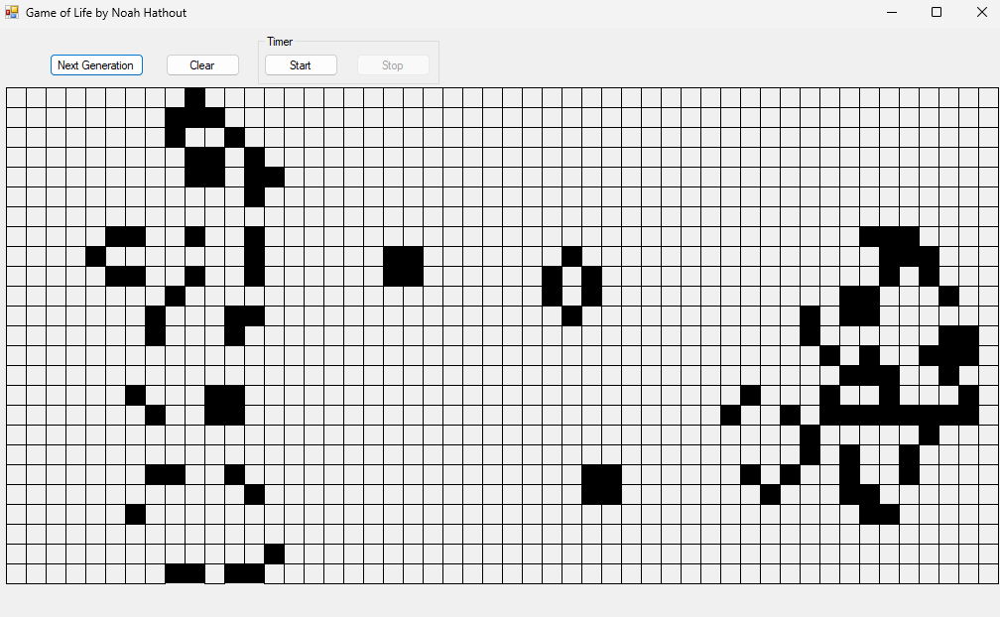

# GameOfLife

*A fully interactive C# /.NET Windows Forms recreation of Conway’s classic cellular-automaton.*

## At a Glance
- **50 × 25 grid** (20 px cells)  
- **Draw with the mouse:** left-click toggles cells **on**, right-click toggles **off**  
- **One-shot step**, **continuous play**, **stop**, and **clear** controls  
- Built-in **timer** (1 s interval) for smooth animation  
- Double-buffered rendering for flicker-free graphics

## Getting Started

### Prerequisites
- Visual Studio 2022 (or later) with the **.NET Desktop Development** workload  
- .NET Framework 4.8 (or retarget to any Windows Forms-capable framework)
